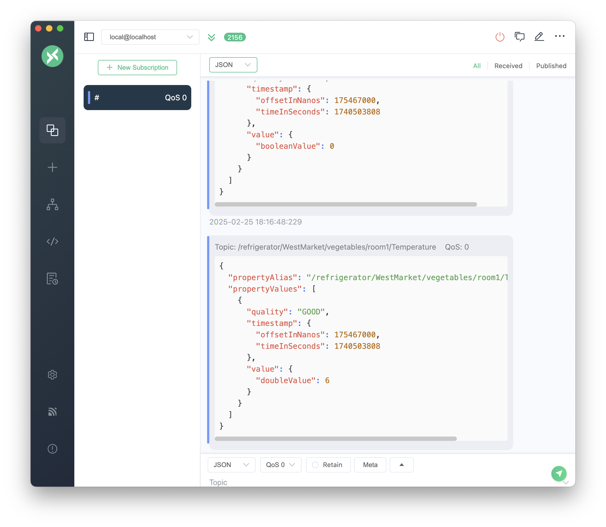

sitewise-mqtt-sfc
=================

Use an MQTT-enabled AWS IoT Sitewise gateway to send data from various industrial equipment, using [SFC](https://github.com/aws-samples/shopfloor-connectivity), to Sitewise Service in the cloud.

```sh
               +------------------MQTT-enabled-Sitewise-Gateway------+                    
               |  SFC   VTL                                          |                    
               |  CONF  CONF                                         |                    
               |   |     |                                           |                    
               | +-+-----+--+     +-------------+     +-----------+  |                    
               | |          |     |             |     |           +--+--> AWS IoT Sitewise
MODBUS-TCP ----+-+   SFC    +-----> MQTT Broker +-----> Publisher |  |                    
DEVICE         | |          |     |             |     |           +--+--> Amazon S3       
               | +----------+     +-------------+     +-----------+  |                    
               |                                                     |                    
               |                                                     |                    
               +-----------------------------------------------------+                     
```

### Steps
- [Login to SW Gateway and clone Repo](#step-1-login-to-sw-gateway-and-clone-repo)
- [Run Modbus simulator](#step-2-run-modbus-simulator)
- [Install SFC](#step-3-install-sfc)
- [Inspect the SFC config and Velocity Template](#step-4-inspect-the-sfc-config-and-velocity-template)
- [Run SFC](#step-5-run-sfc)
- [(Optional) Subscribe to MQTT broker](#step-6-optional-subscribe-to-mqtt-broker)
- [Check Data in Sitewise Service](#step-7-check-data-in-sitewise-service)

<br>
<br>

> The following steps require you to have a running v3 MQTT-enabled AWS IoT Sitewise Gateway.


#### **Step 1**: Login to SW Gateway and clone Repo

- login to your v3 MQTT-enabled Sitewise Gateway
- fyi check the running containers: run `docker ps` - you should see the emqx container bound to port 1883 (that is the mqtt port where we will send data later)
- clone that repo:

```sh
git clone https://github.com/aws-samples/sample-sitewise-mqtt-sfc.git
```

#### **Step 2**: Run Modbus simulator

- modbus simulation will be started at port `502`
- make sure to have the program running detached from your current shell using e.g. `screen`

```sh
# python3 required...
cd modbus
python3 -m venv .venv
source .venv/bin/activate
pip install -r requirements.txt
python modbus-server.py
```

#### **Step 3**: Install SFC

We're using ready to use kotlin SFC binary modules, available as [tar.gz from github](https://github.com/aws-samples/shopfloor-connectivity/releases)
- [`sfc-main`](https://github.com/aws-samples/shopfloor-connectivity/blob/mainline/docs/core/sfc-configuration.md) - the core module, receiving config and doing all the source/target processing.
- [`mqtt-target`](https://github.com/aws-samples/shopfloor-connectivity/blob/mainline/docs/adapters/mqtt.md) - generic mqtt adapter, to send data to mqtt broker topics
- [`debug-target`](https://github.com/aws-samples/shopfloor-connectivity/blob/mainline/docs/targets/debug.md) - inspect the [SFC-Output](https://github.com/aws-samples/shopfloor-connectivity/blob/mainline/docs/sfc-data-format.md) in stdout
- [`modbus-tcp`](https://github.com/aws-samples/shopfloor-connectivity/blob/mainline/docs/adapters/modbus.md) - adapter, to read from modbus devices

```sh
#cd ..
cd sfc
./install.sh # that script downloads all reuqired modules from github...
```

#### **Step 4**: Inspect the SFC config and Velocity Template

The json file [sfc-config.json](./sfc/sfc-config.json) represents an [in-process](https://github.com/aws-samples/shopfloor-connectivity/blob/mainline/docs/sfc-deployment.md) SFC configuration. It does:
- define the sources and the source-channels (=modbus registers)
- define the targets, where the source data is sent to (=mqtt broker)
    - within the targets config sections we set [`Template`](https://github.com/aws-samples/shopfloor-connectivity/blob/mainline/docs/core/target-configuration.md#template) to reference an Apache Velocity Template
    - within the targets config sections we set [`TemplateEpochTimestamp`](https://github.com/aws-samples/shopfloor-connectivity/blob/mainline/docs/core/target-configuration.md#templateepochtimestamp) to `true`, so that epochTimestamps are available in the Velocity Template context. 
    - `Template` and `TemplateEpochTimestamp` is needed to transform the [standard SFC Output Format](https://github.com/aws-samples/shopfloor-connectivity/blob/mainline/docs/sfc-data-format.md) to a Sitewise [BatchPutAssetPropertyValue](https://docs.aws.amazon.com/iot-sitewise/latest/APIReference/API_BatchPutAssetPropertyValue.html)

> *sfc-config.json*

```json
{
    "AWSVersion": "2022-04-02",
    "Name": "read modbus-tcp, transform payload to Sitewise BatchPutAssetPropertyValue & send to local edge mqtt broker",
    "Version": 1,
    "LogLevel": "Info",
    "ElementNames": {
        "Value": "value",
        "Timestamp": "timestamp",
        "Metadata": "metadata"
    },
    "Schedules": [
        {
            "Name": "Modbus2Mqtt",
            "Interval": 500,
            "Description": "read from local modbus-tcp server at port 502",
            "Active": true,
            "TimestampLevel": "Both",
            "Sources": {
                "modbus-source": [
                    "*"
                ]
            },
            "Targets": [
                "#DebugTarget",
                "swMqttTarget"
            ]
        }
    ],
    "Sources": {
        "modbus-source": {
            "Name": "ModbusSource1",
            "ProtocolAdapter": "ModbusAdapter",
            "Description": "Production line Modbus source",
            "AdapterDevice": "PLC1",
            "Channels": {
                "4": {
                    "Name": "/refrigerator/WestMarket/vegetables/room1/Compressor_rpm",
                    "Address": 4,
                    "Type": "HoldingRegister"
                },
                "5": {
                    "Name": "/refrigerator/WestMarket/vegetables/room1/Condensator",
                    "Address": 5,
                    "Type": "HoldingRegister"
                },
                "6": {
                    "Name": "/refrigerator/WestMarket/vegetables/room1/Defrosting",
                    "Address": 6,
                    "Type": "HoldingRegister"
                },
                "7": {
                    "Name": "/refrigerator/WestMarket/vegetables/room1/Door_state",
                    "Address": 7,
                    "Type": "HoldingRegister"
                },
                "8": {
                    "Name": "/refrigerator/WestMarket/vegetables/room1/Power",
                    "Address": 8,
                    "Type": "HoldingRegister"
                },
                "9": {
                    "Name": "/refrigerator/WestMarket/vegetables/room1/State",
                    "Address": 9,
                    "Type": "HoldingRegister"
                },
                "10": {
                    "Name": "/refrigerator/WestMarket/vegetables/room1/Temperature",
                    "Address": 10,
                    "Type": "HoldingRegister"
                }
            }
        }
    },
    "Targets": {
        "DebugTarget": {
            "Active": true,
            "TargetType": "DEBUG-TARGET",
            "TemplateEpochTimestamp": true,
            "Template": "swBatchPutTemplate.vm"
        },
        "swMqttTarget": {
            "TargetType": "MQTT-TARGET",
            "EndPoint": "tcp://localhost",
            "Port": 1883,
            "TopicName": "%channel%", 
            "TemplateEpochTimestamp": true,
            "Template": "swBatchPutTemplate.vm"
        }
    },
    "TargetTypes": {
        "DEBUG-TARGET": {
            "JarFiles": [
                "${SFC_DEPLOYMENT_DIR}/debug-target/lib"
            ],
            "FactoryClassName": "com.amazonaws.sfc.debugtarget.DebugTargetWriter"
        },
        "MQTT-TARGET": {
            "JarFiles": [
                "${SFC_DEPLOYMENT_DIR}/mqtt-target/lib"
            ],
            "FactoryClassName": "com.amazonaws.sfc.mqtt.MqttTargetWriter"
        }
    },
    "AdapterTypes": {
        "MODBUS-TCP": {
            "JarFiles": [
                "${SFC_DEPLOYMENT_DIR}/modbus-tcp/lib/"
            ],
            "FactoryClassName": "com.amazonaws.sfc.modbus.tcp.ModbusTcpAdapter"
        }
    },
    "ProtocolAdapters": {
        "ModbusAdapter": {
            "AdapterType": "MODBUS-TCP",
            "Devices": {
                "PLC1": {
                    "Name": "PLC1",
                    "Address": "localhost",
                    "DeviceId": 1,
                    "Port": 502,
                    "ConnectTimeout": 5000,
                    "WaitAfterConnectError": 5000,
                    "WaitAfterWriteError": 1000,
                    "WaitAfterReadError": 1000
                }
            }
        }
    }
}
```
<br>
<br>

> *swBatchPutTemplate.vm*

The Velocity Template [swBatchPutTemplate.vm](./sfc/swBatchPutTemplate.vm), referenced in the SFC config file above, transforms the [standard SFC Output Format](https://github.com/aws-samples/shopfloor-connectivity/blob/mainline/docs/sfc-data-format.md) to a Sitewise [BatchPutAssetPropertyValue](https://docs.aws.amazon.com/iot-sitewise/latest/APIReference/API_BatchPutAssetPropertyValue.html)


```sh
{
    #foreach($sourceName in $sources.keySet())
        #set($source = $sources[$sourceName])
        ## source values loop
        #foreach($valueName in $source["values"].keySet())
            #set( $value = $source["values"][$valueName]["value"] )
            #set( $ts_epoch = $source["values"][$valueName]["timestamp_epoch_sec"] )
            #set( $ts_offset = $source["values"][$valueName]["timestamp_epoch_offset_nanosec"] )
            "propertyAlias": "$valueName",
            "propertyValues": [
            {
                    "quality": "GOOD",
                    "timestamp": {
                        "offsetInNanos": $ts_offset,
                        "timeInSeconds": $ts_epoch
                    },
                    "value": {
                        #if( $valueName.endsWith("Compressor_rpm"))
                            "doubleValue": $value
                        #end
                        #if( $valueName.endsWith("Condensator"))
                            "doubleValue": $value
                        #end
                        #if( $valueName.endsWith("Defrosting"))
                            "integerValue": $value
                        #end
                        #if( $valueName.endsWith("Door_state"))
                            "booleanValue": $value
                        #end
                        #if( $valueName.endsWith("Power"))
                            "doubleValue": $value
                        #end
                        #if( $valueName.endsWith("State"))
                            "booleanValue": $value
                        #end
                        #if( $valueName.endsWith("Temperature"))
                            "doubleValue": $value
                        #end
                    }
            }
        #end
        ]
    #end
}
```

#### **Step 5**: Run SFC

```sh
# cd sfc
cat run.sh
# export SFC_DEPLOYMENT_DIR=$(pwd)
# sfc-main/bin/sfc-main -config sfc-config.json -info
./run.sh
#2025-02-25 16:36:33.27  INFO  - Creating configuration provider of type ConfigProvider
#2025-02-25 16:36:33.38  INFO  - Waiting for configuration
#2025-02-25 16:36:33.55  INFO  - Sending initial configuration from file "sfc-config.json"
#2025-02-25 16:36:33.999 INFO  - Received configuration data from config provider
#2025-02-25 16:36:34.01  INFO  - Waiting for configuration
#2025-02-25 16:36:34.02  INFO  - Creating and starting new service instance
#2025-02-25 16:36:34.101 INFO  - Created instance of service MainControllerService
#2025-02-25 16:36:34.102 INFO  - Running service instance
#2025-02-25 16:36:34.103 INFO  - Creating an in-process reader for adapter "ModbusAdapter" of protocol adapter type MODBUS-TCP
#2025-02-25 16:36:34.161 INFO  - SFC_MODULE MODBUS-TCP: VERSION=1.0.0, MODBUS_VERSION=1.0.0, SFC_CORE_VERSION=1.8.1, SFC_IPC_VERSION=1.8.1, BUILD_DATE=2025-02-14
#2025-02-25 16:36:34.165 INFO  - Creating in process target writer for target ID swMqttTarget
#2025-02-25 16:36:34.259 INFO  - SFC_MODULE MQTT-TARGET: VERSION=1.0.0, SFC_CORE_VERSION=V1.8.2, SFC_IPC_VERSION=V1.8.2, BUILD_DATE=2025-02-24
#2025-02-25 16:36:34.261 INFO  - MQTT Writer for target "swMqttTarget" writer publishing to topics at endpoint tcp://localhost on target swMqttTarget
#2025-02-25 16:36:34.265 INFO  - No adapter or target metrics are collected
#2025-02-25 16:36:34.307 INFO  - Connected to localhost:502
```

#### **Step 6**: (Optional) Subscribe to MQTT broker

Subscribe to the local broker and check the Messages coming in at `#` - JSON shall reflect to our [Velocity template](./sfc/swBatchPutTemplate.vm)

- using **mosquitto**: 

```sh
mosquitto_sub -h localhost -t "#"
```

- using **mqttx**




#### **Step 7**: Check Data in Sitewise Service

```sh
export ASSET_ID="1718c2c2-b1ef-4783-8ea7-05946c0f09e0"
export PROPERTY_ID="048ed6e9-e459-4588-a10a-36936127fede"
export REGION="ap-southeast-2"

aws iotsitewise get-asset-property-value \
  --asset-id $ASSET_ID \
  --property-id $PROPERTY_ID \
  --region $REGION

#{
#    "propertyValue": {
#        "value": {
#            "doubleValue": 38215.0
#        },
#        "timestamp": {
#            "timeInSeconds": 1740501344,
#            "offsetInNanos": 927155000
#        },
#        "quality": "GOOD"
#    }
#}
```
