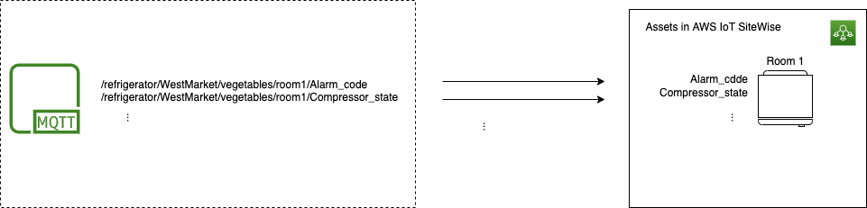
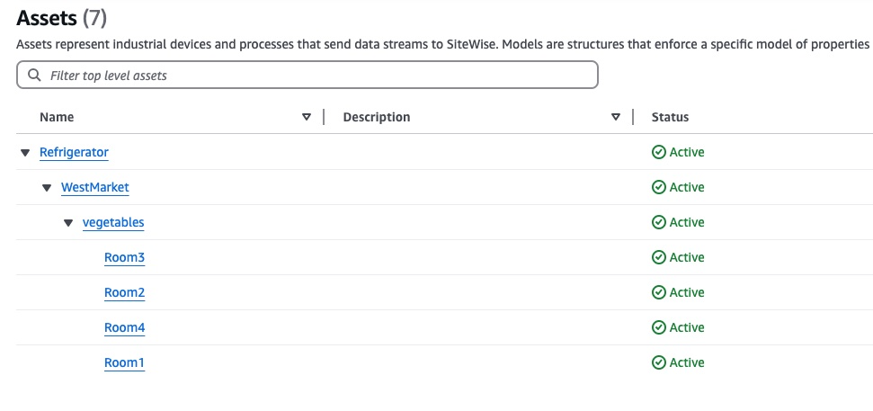
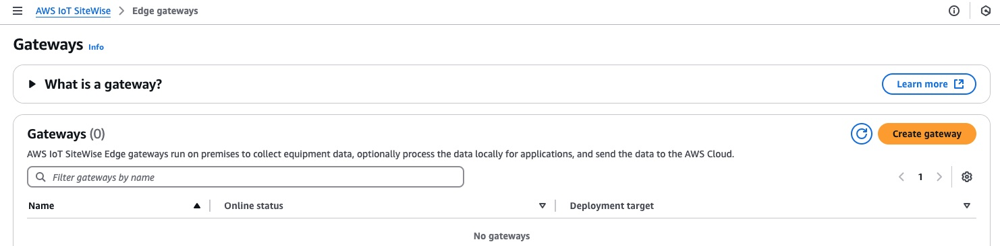
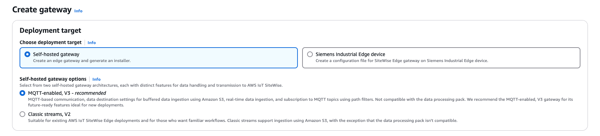
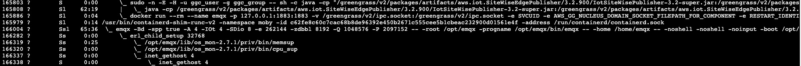
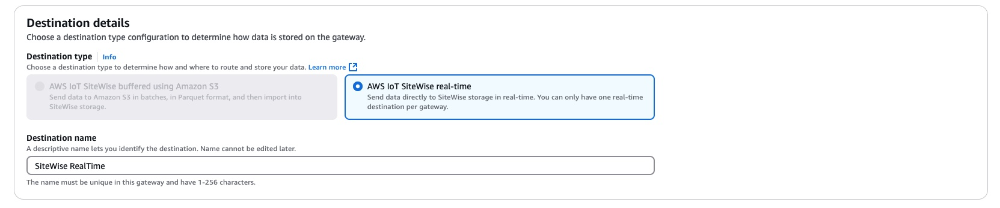
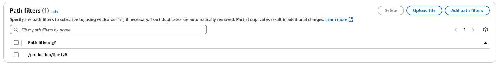
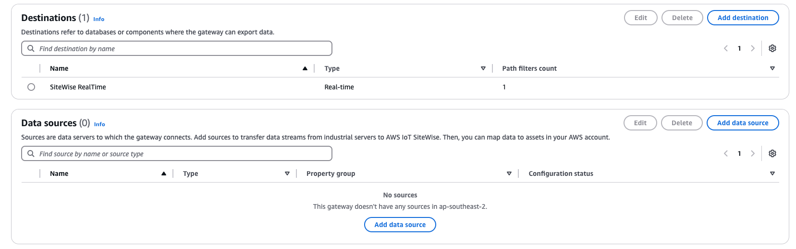
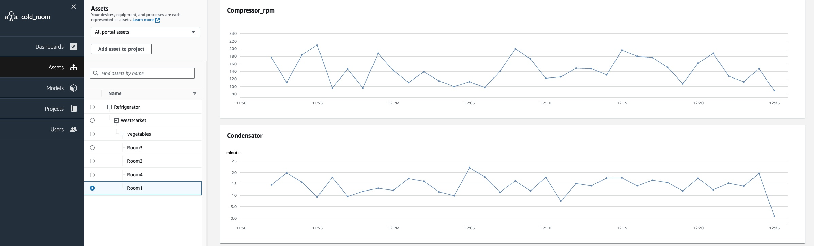

sitewise-mqtt-sfc
=================

Use an MQTT-enabled AWS IoT Sitewise gateway to send data from various industrial equipment, using [SFC](https://github.com/aws-samples/shopfloor-connectivity), 
to Sitewise Service in the cloud. An example showing how to ingest data to Sitewise from Modbus equipment.

- [Overview of MQTT-enabled Sitewise Gateways](#overview-of-mqtt-enabled-sitewise-gateways)
- [MQTT-enabled Gateway - Message Format](#mqtt-enabled-gateway---message-format)
- [An Integration Example using SFC](#an-integration-example-using-sfc)
    - [Step 1: Definition of data model and data assets](#step-1-definition-of-data-model-and-data-assets)
        - [Data model](#data-model)
        - [Alias mapping](#alias-mapping)
    - [Step 2: Installation of sitewise edge with MQTT](#step-2-installation-of-sitewise-edge-with-mqtt)
    - [Step 3: Data destination definition and filtering](#step-3-data-destination-definition-and-filtering)
    - [Step 4: Run Modbus Sim, Install & Run SFC](#step-4-run-modbus-sim-install--run-sfc)
        - [Login to SW Gateway and clone Repo](#login-to-sw-gateway-and-clone-repo)
        - [Run Modbus simulator](#run-modbus-simulator)
        - [Install SFC](#install-sfc)
        - [Inspect the SFC config and Velocity Template](#inspect-the-sfc-config-and-velocity-template)
        - [Run SFC](#run-sfc)
        - [(Optional) Subscribe to local MQTT broker](#optional-subscribe-to-local-mqtt-broker)
        - [Check Data in Sitewise Service](#check-data-in-sitewise-service)
- [Conclusion](#conclusion)

## Overview of MQTT-enabled Sitewise Gateways 

The External Broker Integration represents a fundamental evolution in AWS IoT SiteWise Edge's architecture, introducing a more streamlined and flexible approach to data handling. At its core, the system now operates the MQTT broker that results the backbone across the function of data collection, processing, and transmission. The system is based on  three main components that are :

* `MQTT Broker`, serves as the heart of the system. It functions as a central communication hub where all internal components interact and exchange information. It provides an external interface that allows for custom integrations, making the system more versatile and adaptable to various industrial needs.
* `OPC-UA Collector`, operates as a specialized MQTT client. Its primary role is to gather data from OPC-UA sources and publish this information through the MQTT broker. This component ensures reliable data acquisition from industrial systems while maintaining compatibility with existing OPC-UA infrastructure.
* `SiteWise Publisher`, acts as the bridge between edge and cloud storage and data modeling.It efficiently manages the transmission of the ingested  data to AWS IoT SiteWise Cloud, with related capabilities of store and forward (for loss of internet connectivity). ensuring that data is securely stored in the cloud.

This architectural redesign brings several significant advantages. The standardization of communication through MQTT protocols simplifies the overall system while maintaining robust functionality. The flexible integration capability allows external modules - `External Protocol Concerters` - to connect seamlessly as MQTT clients, similar to the built-in OPC-UA collector creating a unified data flow ensures that all data, regardless of its source, follows a consistent path through the MQTT-based pipeline, using standardized topic structures for the measurement identification.
The result is a system where OT and custom protocols can be integrated with the same ease as native protocols like OPC-UA. This uniformity in data processing and filtering enables organizations to combine data from diverse sources into a single, cohesive asset management system.


```
          +----------+                                                               
          | External |  MQTT                                                         
  +-------+ Protocol +--------------+                                                
3rd party | converter|              |                                                
protocol  +----------+              |                                                
                                    |                                                
          +-------------------------+---------------------------+                    
          |                         |                           |                    
          |                         |                           |                    
          | +----------+     +------v------+     +-----------+  |                    
          | |          |MQTT |             |MQTT |           +--+--> AWS IoT Sitewise
OPC-UA----+-+  OPC-UA  +-----> MQTT Broker +-----> Publisher |  |                    
Server    | | Collector|     |             |     |           +--+--> Amazon S3       
          | +----------+     +-------------+     +-----------+  |                    
          |                                                     |                    
          |                                                     |                    
          +---MQTT-enabled-Sitewise-Gateway---------------------+                                        
```

*Figure 1:  MQTT-enabled Sitewise Gateway - Open for external Protocol-Converters*


## MQTT-enabled Gateway - Message Format

The MQTT message format follows the AWS IoT SiteWise API standard, utilizing a JSON structure that specifies both 'alias' and 'values' properties. Here's an example of the required format:


```json
{
         "propertyAlias": "/production/line1/device1/sensor1",
         "propertyValues": [
            {
               "quality": "GOOD",
               "timestamp": {
                  "offsetInNanos": 0,
                  "timeInSeconds": 1738345785
               },
               "value": {
                  "doubleValue": 6.6
               }
            }
         ]
      }
```

Key components of the message format:

* `propertyAlias`: A unique identifier that maps to the asset property in AWS IoT SiteWise
* `propertyValues`: An array containing measurement data points
    * `value`: The actual measurement value
    * `timestamp`: The Unix timestamp in milliseconds with nano second where is needed
    * `quality`: quality of the measurements

This standardized format ensures consistent data handling and proper integration with AWS IoT SiteWise's asset modeling system. All MQTT messages must adhere to this structure for successful data ingestion and processing. The 'propertyAlias' plays a fundamental role in the AWS IoT Publisher's filtering and routing mechanisms. This identifier must maintain consistency with the MQTT topic structure to ensure proper data flow. The propertyAlias structure should mirror your MQTT topic hierarchy, making IoT SiteWise ready for the implementation of a Unified Name Space (UNS).


## An Integration Example using SFC

In this example, we will demonstrate how to integrate a cold room refrigeration system with AWS IoT SiteWise. The refrigeration system exposes data via Modbus TCP protocol, and we will utilize the [`Shopfloor Connectivity (SFC)`](https://github.com/aws-samples/shopfloor-connectivity) framework as `external protocol converter`, collecting and publishing the data to the local MQTT broker.

```
               +------------------MQTT-enabled-Sitewise-Gateway------+                    
               |  SFC   VTL                                          |                    
               |  CONF  CONF                                         |                    
               |   |     |   (2)               (3)                   |                    
               | +-+-----+--+     +-------------+     +-----------+  |                    
          (1)  | |          |     |             |     |           +--+--> AWS IoT Sitewise
Modbus-TCP ----+-+   SFC    +-----> MQTT Broker +-----> Publisher |  |            (4,5)   
Cold Room      | |          |     |             |     |           +--+--> Amazon S3       
Simulator      | +----------+     +-------------+     +-----------+  |                    
               |                                                     |                    
               |                                                     |                    
               +-----------------------------------------------------+                    
```

*Figure 2: SFC used as `External protocol converter`, collecting fom Modbus-TCP & sending to local MQTT broker*


As shown in Figure 2, the demonstration system consists of five main components:

1. Cold Room Equipment simulator (Modbus TCP). The physical refrigeration system being monitored, equipped with Modbus TCP capability for data communication.
2. SFC handles protocol conversion and data transformation from Modbus TCP to MQTT.
3. AWS IoT SiteWise Edge component that processes and manages data collection, including the MQTT broker for message handling.
4. AWS IoT SiteWise Cloud - The cloud service that stores, processes, and manages asset data and models.
5. Visualization Interface The dashboard system that displays real-time cold room monitoring data and analytics.

### **Step 1: Definition of data model and data assets**

In our example we are ingesting the data from modbus with the following structure: 

|Modbus Address	    |       Registry	|           SiteWise Alias- MQTT Topic	                     |
|-------------------|-------------------|------------------------------------------------------------|
|`2`	            |Alarm_code	        |`/refrigerator/WestMarket/vegetables/room1/Alarm_code`	     |
|`3`	            |Compressor state	|`/refrigerator/WestMarket/vegetables/room1/Compressor_state`|
|`4`	            |Compressor rpm	    |`/refrigerator/WestMarket/vegetables/room1/Compressor_rpm`	 |
|`5`	            |Condensator	    |`/refrigerator/WestMarket/vegetables/room1/Condensator`	 |
|`6`	            |Defrosting	        |`/refrigerator/WestMarket/vegetables/room1/Defrosting`	     |
|`7`	            |Door state	        |`/refrigerator/WestMarket/vegetables/room1/Door_state`	     |
|`8`	            |Power consumption	|`/refrigerator/WestMarket/vegetables/room1/Power`           |
|`9`	            |Status	            |`/refrigerator/WestMarket/vegetables/room1/State`	         |
|`10`	            |Tempurature	    |`/refrigerator/WestMarket/vegetables/room1/Temperature`	 |
|`11`	            |Temperature set	|`/refrigerator/WestMarket/vegetables/room1/Temperature_set` |

For each measurement, an AWS IoT SiteWise property alias must be defined and mapped to its corresponding MQTT topic. This mapping creates a direct relationship between the incoming MQTT messages and the asset properties in AWS IoT SiteWise. The alias has to be unique inside of SiteWise assets. 

#### **Data model:**

The Sitewise bulk import file in [sfc/sitewise-bulk-assets.json](./sfc/sitewise-bulk-assets.json) can be used to create the required asset models, asstes and asset-hierarachies. **Follow the steps, described ion the [Sitewise Bulk-Operations Docs](https://docs.aws.amazon.com/iot-sitewise/latest/userguide/running-bulk-operations-import.html)**.

```json
{
    "assetModelType": "ASSET_MODEL",
    "assetModelName": "Refrigerator",
    "assetModelProperties": [
        {
            "name": "Refrigerator type",
            "dataType": "STRING",
            "type": {
                "attribute": {
                    "defaultValue": "var"
                }
            }
        },
        ...
        
        {
            "name": "Alarm_code",
            "dataType": "INTEGER",
            "type": {
                "measurement": {}
            }
        },
        {
            "name": "Compressor_state",
            "dataType": "DOUBLE",
            "type": {
                "measurement": {}
            }
        }
        
        ...
    ]
}
```

#### **Alias mapping** 
Each measurement created in AWS IoT SiteWise must be connected to its corresponding MQTT topic for automatic data ingestion. This connection establishes the data flow path from the source to AWS IoT SiteWise asset. 



*Figure 3: Property Alias Mapping*

In our example, we've organized the assets in a hierarchical structure to represent multiple cold rooms within the facility. This hierarchy allows for logical grouping and simplified management of cold room assets. The structure represents the physical layout of the refrigeration system, where individual cold rooms are organized as child assets under a parent facility asset. This hierarchical organization enables:

* Easy navigation through different cold rooms
* Consolidated view of all refrigeration units
* Efficient monitoring of multiple cold room parameters
* Simplified data aggregation across the facility



*Figure 4: Created Sitewise Asset Hierarchy*

### **Step 2: Installation of sitewise edge with MQTT** 

Choose the new integration deployment type `MQTT-enabled, V3` during the gateway creation.

- Under edge gateway select create new gateway:



The `MQTT-enabled, V3` is the default gateway type.



*Figure 5 and 6: Create MQTT-enabled Gateway*

The AWS IoT SiteWise Edge installation process remains consistent with [version 2.0](https://docs.aws.amazon.com/iot-sitewise/latest/userguide/install-gateway-software-on-local-device.html), beginning with the download of installation binaries. After installation, the system deploys three main components that work together to enable edge data ingestion and data transmission. It's important to note that Docker installation is a mandatory prerequisite as the MQTT broker runs as a containerized service. Before proceeding with the installation, ensure your system meets all AWS IoT SiteWise Edge requirements and has sufficient resources as specified in the AWS documentation.
At the end of the installation process the system will be up and running with the minimal configuration that contains the MQTT broker and the publisher.



*Figure 7: Process Tree of a v3 MQTT-enabled Sitewise Gateway*


### **Step 3: Data destination definition and filtering** 

This configuration step defines how the Edge Gateway exports data to the cloud. The Edge Gateway offers two primary methods for data transmission:

* `Real-time Upload Data` is continuously transmitted to AWS IoT SiteWise cloud as it is processed at the edge. This method provides immediate data availability for monitoring and analysis.
* `Batch Processing with Amazon S3` Data is collected and uploaded in batches to Amazon S3 buckets. This approach is particularly useful for scenarios with limited connectivity or when optimizing data transfer costs.

In our demo we configure the `real-time` Destination type:



*Figure 8: Configure Data destination*

Data filtering options are available to control which data points are transmitted to the cloud. You can implement filtering MQTT topic base. This filtering capability helps optimize bandwidth usage and storage costs while ensuring that relevant data is properly transmitted. In our case we can leave the default Path as `#`.



*Figure 9: Configure Data filtering*

When implementing the External Broker integration through MQTT, no Data Source configuration is required. Data Source configuration is specifically designed for and limited to OPC-UA implementations.



*Figure 10: Configure Data destinations*


### **Step 4: Run Modbus Sim, Install & Run SFC** 
The SFC supports several OT protocols, and implement message manipulation through [Velocity templates](https://github.com/aws-samples/shopfloor-connectivity/blob/mainline/docs/sfc-target-templates.md). That gives the possibility to ingest data from different protocols with simple configuration avoiding to write any code.

#### Login to SW Gateway and clone Repo

- Login to your v3 MQTT-enabled Sitewise Gateway
- fyi check the running containers: run `docker ps` - you should see the emqx container bound to port 1883 (that is the mqtt port where we will send data later)
- clone that repo:

```sh
git clone https://github.com/aws-samples/sample-sitewise-mqtt-sfc.git
```

#### Run Modbus simulator

- Modbus simulation will be started at port `502`
- Make sure to have the program running detached from your current shell using e.g. `screen`

```sh
# python3 required...
# cd sample-sitewise-mqtt-sfc
cd modbus
python3 -m venv .venv
source .venv/bin/activate
pip install -r requirements.txt
python modbus-server.py
```

#### Install SFC

We're using ready to use kotlin SFC binary modules, available as [tar.gz from github](https://github.com/aws-samples/shopfloor-connectivity/releases)
- [`sfc-main`](https://github.com/aws-samples/shopfloor-connectivity/blob/mainline/docs/core/sfc-configuration.md) - the core module, receiving config and doing all the source/target processing.
- [`mqtt-target`](https://github.com/aws-samples/shopfloor-connectivity/blob/mainline/docs/adapters/mqtt.md) - generic mqtt adapter, to send data to mqtt broker topics
- [`debug-target`](https://github.com/aws-samples/shopfloor-connectivity/blob/mainline/docs/targets/debug.md) - inspect the [SFC-Output](https://github.com/aws-samples/shopfloor-connectivity/blob/mainline/docs/sfc-data-format.md) in stdout
- [`modbus-tcp`](https://github.com/aws-samples/shopfloor-connectivity/blob/mainline/docs/adapters/modbus.md) - adapter, to read from modbus devices

```sh
#cd ..
cd sfc
./install.sh # that script downloads all required modules from github...
```

#### Inspect the SFC config and Velocity Template

> Note: SFC also comes with a native [SitewiseEdge Adapter](https://github.com/aws-samples/shopfloor-connectivity/blob/mainline/docs/targets/aws-sitewiseedge.md), 
having all mappings for the the v3 MQTT-enabled Gateway already included. That example here shows the generic [payload-transformation capabilities](https://github.com/aws-samples/shopfloor-connectivity/blob/mainline/docs/sfc-target-templates.md) of SFC.

The json file [sfc-config.json](./sfc/sfc-config.json) represents an [in-process](https://github.com/aws-samples/shopfloor-connectivity/blob/mainline/docs/sfc-deployment.md) SFC configuration. It does:
- define the **Sources** and the [source-channels](https://github.com/aws-samples/shopfloor-connectivity/blob/mainline/docs/adapters/modbus.md#modbuschannelconfiguration) (=modbus registers)
- define the **Targets**, where the source data is sent to (=mqtt broker) - related by one or more [Schedules](https://github.com/aws-samples/shopfloor-connectivity/blob/mainline/docs/core/schedule-configuration.md)
    - within the Targets.swMqttTarget config sections we set [`TopicName`](https://github.com/aws-samples/shopfloor-connectivity/blob/mainline/docs/targets/mqtt.md#topicname) to `%channel%`. The [Mqtt-Target adapter](https://github.com/aws-samples/shopfloor-connectivity/blob/mainline/docs/targets/mqtt.md) supports to use source `channel` names as [dynamic variables](https://github.com/aws-samples/shopfloor-connectivity/blob/mainline/docs/targets/mqtt.md#topicname), in order to fan out each channel value to a matching mqtt-topic (channel-name==mqtt-topic-name).
    - within the Targets.swMqttTarget config sections we set [`Template`](https://github.com/aws-samples/shopfloor-connectivity/blob/mainline/docs/core/target-configuration.md#template) to reference an Apache Velocity Template
    - within the Targets.swMqttTarget config sections we set [`TemplateEpochTimestamp`](https://github.com/aws-samples/shopfloor-connectivity/blob/mainline/docs/core/target-configuration.md#templateepochtimestamp) to `true`, so that epochTimestamps are available in the Velocity Template context. 
    - `Template` and `TemplateEpochTimestamp` are needed to transform the [standard SFC Output Format](https://github.com/aws-samples/shopfloor-connectivity/blob/mainline/docs/sfc-data-format.md) to a Sitewise [BatchPutAssetPropertyValue](https://docs.aws.amazon.com/iot-sitewise/latest/APIReference/API_BatchPutAssetPropertyValue.html)

<br>
<br>

> [*sfc-config.json*](./sfc/sfc-config.json)

**Definition of the source:**
The source definition consists of two essential components that work together to establish the data collection framework.
The first component is the Endpoint Configuration, which defines all necessary connection parameters to the data source. This includes the protocol-specific settings, connection credentials, network address and port information, as well as communication timeouts.

```json
{
    "ProtocolAdapters": {
        "ModbusAdapter": {
            "AdapterType": "MODBUS-TCP",
            "Devices": {
                "PLC1": {
                    "Name": "PLC1",
                    "Address": "localhost",
                    "DeviceId": 1,
                    "Port": 502,
                    "ConnectTimeout": 5000,
                    "WaitAfterConnectError": 5000,
                    "WaitAfterWriteError": 1000,
                    "WaitAfterReadError": 1000
                }
            }
        }
    }
}
```

The second component is the Data Structure Definition, which specifies exactly what data needs to be collected from the source. This encompasses the measurement points, their respective data types and specific reading parameters. The data structure definition ensures that the system knows precisely which information to collect and how to interpret it.

```json
{
    "Sources": {
        "modbus-source": {
            "Name": "ModbusSource1",
            "ProtocolAdapter": "ModbusAdapter",
            "Description": "Production line Modbus source",
            "AdapterDevice": "PLC1",
            "Channels": {
                "Compressor_rpm": {
                    "Name": "/refrigerator/WestMarket/vegetables/room1/Compressor_rpm",
                    "Address": 4,
                    "Type": "HoldingRegister"
                },
                ...
            }
        }
    }
}
```


**Definition of the target**
Like in the source the Targets section defines all necessary connection parameters to the target and the related template for the message transformation.

```json
 {
    "Targets": {
        "swMqttTarget": {
            "TargetType": "MQTT-TARGET",
            "EndPoint": "tcp://localhost",
            "Port": 1883,
            "TopicName": "%channel%",
            "TemplateEpochTimestamp": true,
            "Template": "IoTSiteWiseTemplate.vm"
        }
    },
}
```

<br>
<br>
<br>

**Message transformation**
SFC includes a built-in Velocity template capability that simplifies message formatting for AWS IoT SiteWise. This template automatically handles the conversion of data into the required AWS IoT SiteWise JSON format. Through simple configuration settings, the template ensures that messages are properly structured with the required 'alias' and 'values' properties. This eliminates the need for custom code development and reduces the complexity of message transformation.

> [*swBatchPutTemplate.vm*](./sfc/swBatchPutTemplate.vm)

```sh
{
    #foreach($sourceName in $sources.keySet())
        #set($source = $sources[$sourceName])
        ## source values loop
        #foreach($valueName in $source["values"].keySet())
            #set( $value = $source["values"][$valueName]["value"] )
            #set( $ts_epoch = $source["values"][$valueName]["timestamp_epoch_sec"] )
            #set( $ts_offset = $source["values"][$valueName]["timestamp_epoch_offset_nanosec"] )
            "propertyAlias": "$valueName",
            "propertyValues": [
            {
                    "quality": "GOOD",
                    "timestamp": {
                        "offsetInNanos": $ts_offset,
                        "timeInSeconds": $ts_epoch
                    },
                    "value": {
                        #if( $valueName.endsWith("Compressor_rpm"))
                            "doubleValue": $value
                        #end
                        #if( $valueName.endsWith("Condensator"))
                            "doubleValue": $value
                        #end
                        #if( $valueName.endsWith("Defrosting"))
                            "integerValue": $value
                        #end
                        #if( $valueName.endsWith("Door_state"))
                            "booleanValue": $value
                        #end
                        #if( $valueName.endsWith("Power"))
                            "doubleValue": $value
                        #end
                        #if( $valueName.endsWith("State"))
                            "booleanValue": $value
                        #end
                        #if( $valueName.endsWith("Temperature"))
                            "doubleValue": $value
                        #end
                    }
            }
        #end
        ]
    #end
}
```
<br>
<br>

> [*sfc-config.json*](./sfc/sfc-config.json)

**Definition of the reading frequency**
The final component of the configuration involves setting the data ingestion frequency, which, in the case of Modbus, corresponds to the reading frequency from the device.
This setting determines how often the system polls the Modbus device for new data.

```json
{
    "Schedules": [
        {
            "Name": "Modbus2Mqtt",
            "Interval": 5000,
            "Description": "read from local modbus-tcp server at port 502",
            "Active": true,
            "TimestampLevel": "None",
            "Sources": {
                "modbus-source": [
                    "*"
                ]
            },
            "Targets": [
                "swMqttTarget"
            ]
        }
    ]
}
```


#### Run SFC

```sh
# cd sfc
cat run.sh
# export SFC_DEPLOYMENT_DIR=$(pwd)
# sfc-main/bin/sfc-main -config sfc-config.json -info
./run.sh
```

#### (Optional) Subscribe to local MQTT broker

Subscribe to the local broker and check the Messages coming in at `#` - JSON shall reflect to our [Velocity template](./sfc/swBatchPutTemplate.vm)

- using **mosquitto**: 

```sh
mosquitto_sub -h localhost -t "#"
```

- using **mqttx**


*Figure 11: Inspect local mqtt broker*


#### Check Data in Sitewise Service

With the system successfully configured, we can now leverage AWS IoT SiteWise Monitor's capabilities to visualize and analyze  cold room data with :

* Dashboard Creation, Create customized dashboards to display real-time and historical data from  refrigeration systems. These dashboards can include temperature trends, operational metrics, and system status indicators.
* Alarm Configuration ,Set up alarms to monitor critical parameters and receive notifications when values exceed predetermined thresholds. This ensures prompt response to potential issues in your cold room operations.
* Data Analysis, Access comprehensive data visualization tools to analyze performance trends, identify patterns, and optimize your refrigeration system's operation.




*Figure 12: Sitewise Monitor*


## Conclusion

This architectural enhancement of AWS IoT SiteWise Edge significantly expands the potential for custom integrations in industrial IoT scenarios. The new MQTT-based architecture delivers three key advantages:

* Legacy System Integration Organizations can now seamlessly integrate legacy systems that use proprietary protocols, preserving existing infrastructure investments while modernizing data collection capabilities.
* Specialized Equipment Support The architecture enables direct incorporation of data from specialized sensors and equipment, regardless of their native communication protocols, expanding monitoring capabilities across diverse industrial assets.
* Environmental Adaptability The flexible architecture allows for customized solutions that adapt to unique industrial environments, accommodating specific operational requirements and constraints.

By leveraging this MQTT-based architecture, manufacturers can create comprehensive IoT solutions that unite diverse data sources. This integration capability leads to more efficient operations, better decision-making, and enhanced industrial process insights.